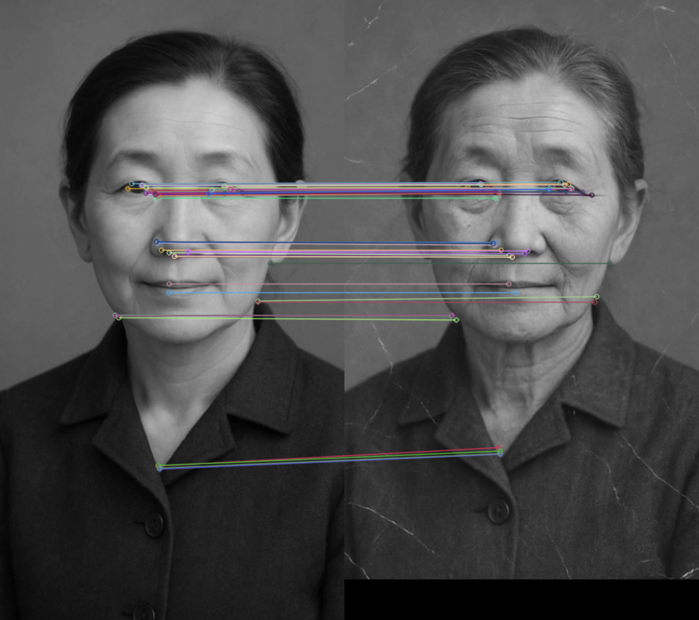
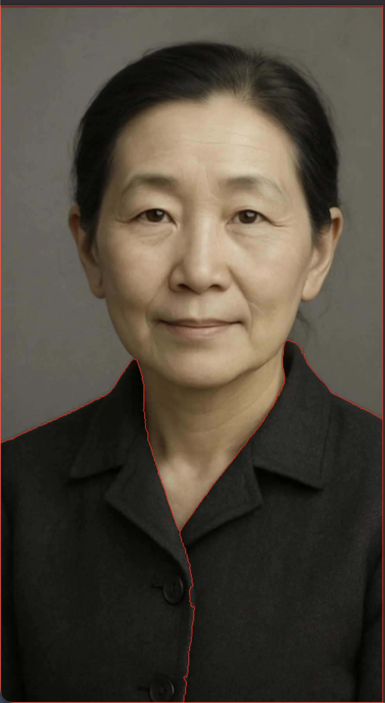

# CV Playground

A collection of small computer vision scripts built with OpenCV and Tkinter. Each script is a standalone desktop tool for trying out a specific image processing technique.

## Projects in Action

Feature matching in action!



Image segmentation in action!



## Scripts

- **`gray.py`**: opens an image and converts it to grayscale.
- **`sketch.py`**: converts an image into a pencil sketch and lets you save the result as a PNG.
- **`liveGrayFilter.py`**: applies a live grayscale filter to your webcam feed.
- **`imageSegmentation.py`**: segments an image into regions using the watershed algorithm.
- **`featureMatching.py`**: matches features between two images using the ORB (Oriented FAST and Rotated BRIEF) algorithm.

Each script opens its own Tkinter window with buttons for loading images and running the operation. Results are shown in an OpenCV window.

## Dependencies

- Python 3
- OpenCV (`opencv-python`)
- NumPy
- Pillow (used by `sketch.py`)
- Tkinter (included with most Python installations)

Install with:

```bash
pip install opencv-python numpy pillow
```

## Usage

Run any script directly:

```bash
python gray.py
python sketch.py
python liveGrayFilter.py
python imageSegmentation.py
python featureMatching.py
```

A sample image, `parrot.png`, is included for quick testing.

## Notes

This is a playground for experimenting with OpenCV techniques rather than a single unified application. Each file works independently.